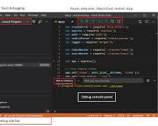
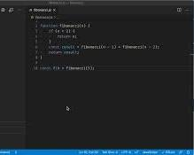
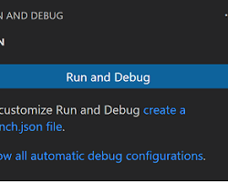
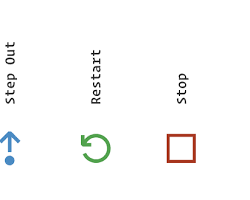
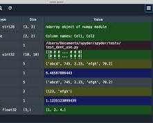
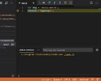
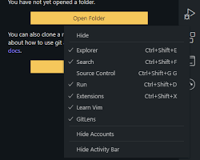
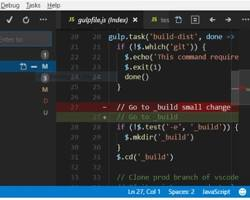
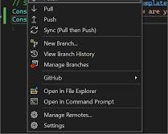

# SE-Assignment-5
Installation and Navigation of Visual Studio Code (VS Code)
 Instructions:
Answer the following questions based on your understanding of the installation and navigation of Visual Studio Code (VS Code). Provide detailed explanations and examples where appropriate.

 Questions:

1. Installation of VS Code:
   - Describe the steps to download and install Visual Studio Code on Windows 11 operating system. Include any prerequisites that might be needed.
Prerequisites:
Windows 11 Operating System: Ensure you have Windows 11 installed on your machine.
Internet Connection: You'll need an internet connection to download the installer.
 Open a Web Browser: Launch your preferred web browser (Chrome, Edge, Firefox, etc.).
Navigate to VS Code download page: Go to the official Visual Studio Code download page: https://code.visualstudio.com/download
Download the installer: Under the "Download for Windows" section, click the button corresponding to your system architecture (64-bit or 32-bit). Most modern Windows 11 machines are 64-bit, so choose that option unless you're unsure.
Run the installer: Once downloaded, double-click the installer file (VS Code User Setup x.x.x.exe).
License Agreement: In the setup window, review the license agreement. If you agree to the terms, select the "I accept the terms of the license agreement" option and click "Next".
Installation Location: By default, VS Code will install under "C:\Users&lt;username>\AppData\Local\Programs\Microsoft VS Code". You can change this location if you prefer by clicking "Browse" and selecting a different directory. Click "Next" to continue.
Optional Components: You can choose to create a desktop shortcut and/or add VS Code to your system PATH during installation. These options are pre-selected by default. Click "Next" if you're happy with these selections.
Ready to Install: Review the installation summary. If everything looks good, click "Install" to begin the installation process.
Wait for Installation: The installation might take a few minutes depending on your internet speed.
Launch VS Code (Optional): Once the installation is complete, you can choose to launch VS Code directly by checking the "Run Visual Studio Code" option and clicking "Finish".

2. First-time Setup:
   - After installing VS Code, what initial configurations and settings should be adjusted for an optimal coding environment? Mention any important settings or extensions.

General Settings:
Theme: VS Code offers a variety of built-in themes (light and dark) and supports custom themes. Choose a theme that suits your preferences and reduces eye strain during long coding sessions. Popular options include Dark+ (default dark theme) or One Dark Pro (popular dark theme).
Font Size and Zoom: Adjust the font size and zoom level for better code readability. This is found under "File > Preferences > Settings" in windows and searching for "Font Size" and "Zoom Level".
Auto Save: Enable auto save to automatically save your work at regular intervals. This can be found under settings by searching for "Auto Save".
File Associations: Configure VS Code to open specific file types by default. This can be helpful for opening all your Python files automatically in VS Code. Search for "File Associations" in settings.
Extensions:
VS Code offers a vast library of extensions that can significantly enhance your coding experience. Here are some important extensions to consider depending on your programming language:
Language Support: Install language-specific extensions for syntax highlighting, code completion, and linting. Popular examples include:
Python: Pylance (advanced Python language features)
JavaScript/TypeScript: ESLint (linting), Prettier (code formatting)
C++: C/C++ (official extension for C/C++ development)
Version Control: If you plan to use Git for version control, install the Git extension for seamless integration within VS Code.
Debuggers: Depending on your programming language, consider installing a debugger extension for easier debugging.
Exploring Settings:
VS Code offers a rich set of customization options. Take some time to explore the settings menu (under "File > Preferences > Settings" or "Code > Preferences > Settings" on macOS) and experiment with different options to personalize your coding environment.
3. User Interface Overview:
   - Explain the main components of the VS Code user interface. Identify and describe the purpose of the Activity Bar, Side Bar, Editor Group, and Status Bar.
   The Activity Bar provides quick access to different functionalities, the Side Bar offers context-specific views, the Editor Group is where you write your code, and the Status Bar displays relevant information about your project and files.

4. Command Palette:
   - What is the Command Palette in VS Code, and how can it be accessed? Provide examples of common tasks that can be performed using the Command Palette.
The Command Palette offers a powerful way to navigate VS Code efficiently and perform various actions without needing to remember specific keyboard shortcuts or navigate through menus.
   There are three ways to access the Command Palette:
Keyboard Shortcut: The most common method is using the keyboard shortcut:
Windows: Ctrl+Shift+P
Go to Menu: Navigate to the top menu bar and select "View > Command Palette".
Search Icon: Click on the magnifying glass icon in the top right corner of the VS Code window.
Using the Command Palette:
Once you open the Command Palette, you'll see a text input field. Start typing the name of the command you want to execute, and VS Code will suggest relevant options based on your input. You can then select the desired command from the list using your arrow keys and press Enter to run it.
Examples of Common Tasks:
Here are some examples of tasks you can perform using the Command Palette:
File Management:
"New File" - Create a new file within your project.
"Open File" - Open an existing file from your project.
"Save" - Save the currently active file.
"Save As" - Save the currently active file with a different name or location.
Code Editing:
"Format Document" - Format the code in the active file according to the chosen style guide.
"Find and Replace" - Search for specific text and replace it with something else within your project.
"Go to Line" - Jump to a specific line number within the active file.
Version Control (with Git extension installed):
"Git: Clone" - Clone a Git repository from a remote URL.
"Git: Stage Changes" - Stage changes made to files for your next commit.
"Git: Commit" - Commit staged changes with a message.
Extensions:
"Extensions: Install Extension" - Open the VS Code Marketplace to install new extensions.
"Extensions: Manage Extensions" - View and manage installed extensions.
Settings:
"Preferences: Open Settings" - Open the VS Code settings menu for customization.
5. Extensions in VS Code:
   - Discuss the role of extensions in VS Code. How can users find, install, and manage extensions? Provide examples of essential extensions for web development.
The Role of Extensions:
Enhanced Functionality: Extensions add new features to VS Code that aren't available by default. This can include:
Language Support: Syntax highlighting, code completion, linting, and debugging for specific programming languages (such as Python extension for Python development).
Version Control Integration: Seamless integration with Git version control for easier code management.
Task Runners: Automate repetitive tasks like building and testing your code.
Code Formatting: Automatically format your code to maintain a consistent style.
Productivity Boosters: Enhance your workflow with features like code snippets, bracket highlighting, and keyboard shortcuts.
Personalization: Extensions allow you to personalize VS Code's look and feel with themes and color schemes.
Finding, Installing, and Managing Extensions:
VS Code Marketplace: The official VS Code Marketplace is your one-stop shop for extensions: https://marketplace.visualstudio.com/. Browse extensions by category, popularity, or search for keywords related to your needs.
Extension View: Within VS Code, open the Extensions view (Ctrl+Shift+X or Cmd+Shift+X on macOS). This view lets you browse featured extensions, search the marketplace, and manage installed extensions.
Installing Extensions: Click the "Install" button for an extension in the Marketplace or Extensions view. VS Code will handle the download and installation process.
Managing Extensions: The Extensions view allows you to see all installed extensions, enable/disable them, update them, or uninstall them if no longer needed.
Essential Extensions for Web Development:
Here are some popular and essential extensions for web development in VS Code:
Essential Trifecta:
ESLint: Linting extension that identifies potential errors and stylistic issues in your JavaScript/TypeScript code.
Prettier: Code formatter that automatically formats your code according to a chosen style guide, ensuring consistency.
Live Server: Launches a development server directly within VS Code, allowing you to preview your web pages in real-time as you make changes.
Language Support:
HTML, CSS, JavaScript (IntelliSense): Provides intelligent code completion, syntax highlighting, and debugging for web development languages.
Version Control:
Git: Integrates Git functionality directly within VS Code for easier version control management.
Other Helpful Extensions:
Remote Development: Enables you to develop on a remote server or container directly from VS Code.
Debugger for Chrome/Firefox: Debugs your web applications within Chrome or Firefox browser directly from VS Code.
Bracket Pair Colorizer: Colors matching brackets for better code readability in HTML and CSS.

6. Integrated Terminal:
   - Describe how to open and use the integrated terminal in VS Code. What are the advantages of using the integrated terminal compared to an external terminal?

   The integrated terminal in VS Code provides a convenient way to run command-line tools and interact with your operating system directly from your development environment. Here's how to open and use it:
Opening the Terminal:
There are three ways to open the integrated terminal:
Keyboard Shortcut: The quickest way is using the keyboard shortcut:
Windows: Ctrl+ (backtick key)
Terminal Menu: Navigate to the top menu bar and select "Terminal > New Terminal".
Panel: Click on the "+" icon in the bottom panel (usually next to the Status Bar) and select "Terminal".
Using the Terminal:
Once the terminal opens, you can use it to run various commands just like you would in an external terminal window. The terminal has access to your system's environment variables and supports features like:
Command History: Use the up and down arrow keys to navigate through previously entered commands.
Tab Completion: Start typing a command name and press Tab for autocompletion.
Multiple Terminals: Open multiple terminal instances within VS Code to work on different tasks simultaneously.
Advantages of the Integrated Terminal:
Convenience: The integrated terminal eliminates the need to switch between VS Code and a separate terminal window, improving workflow efficiency.
Context Awareness: The terminal can be configured to automatically open in the project directory, saving you time navigating to the correct location.
Integration with VS Code Features: Some VS Code extensions and functionalities can interact with the terminal, providing a seamless development experience. For example, running a task runner might trigger commands within the integrated terminal.
However, there are also some limitations:
Customization: The level of customization might be limited compared to a dedicated terminal emulator.
Advanced Features: Some advanced terminal features offered by external tools might not be available in the integrated terminal.

7. File and Folder Management:
   - Explain how to create, open, and manage files and folders in VS Code. How can users navigate between different files and directories efficiently?
  Creating Files and Folders:

Explorer View: Open the Explorer view by clicking on the file folder icon on the left sidebar.
New File/Folder:
Right-click: Right-click within the Explorer view to create a new file or folder.
Menu: Navigate to the top menu bar and select "File > New File" or "File > New Folder".
Keyboard Shortcuts: Use keyboard shortcuts:
New File: Ctrl+N (Windows/Linux), Cmd+N (macOS)
New Folder: Ctrl+Shift+N (Windows/Linux), Cmd+Shift+N (macOS)
Naming: Enter a desired name for your new file or folder and press Enter to create it.
Opening Files:
Explorer View: Double-click on a file name within the Explorer view to open it in the editor area.
Recent Files: Access recently opened files from the "File" menu or the "Go" menu (depending on VS Code version).
Managing Files and Folders:
Explorer View: Right-click on a file or folder to access various options like:
Rename: Rename the file or folder.
Cut/Copy/Paste: Move or copy files/folders within your project.
Delete: Delete files/folders (use caution!).
Drag and Drop: Drag and drop files/folders within the Explorer view to move or copy them (hold Ctrl key for copying).
Navigating Between Files:
File Tabs: VS Code allows opening multiple files simultaneously in separate tabs within the editor area. Quickly switch between open files using the file tabs.
Go to File: Open the "Go to File" feature by pressing Ctrl+P (Windows/Linux) or Cmd+P (macOS) and start typing the name of the file you want to open. VS Code will suggest matching files as you type.
Open Recent: Access recently opened files from the "File" menu or the "Go" menu (depending on VS Code version).
8. Settings and Preferences:
   - Where can users find and customize settings in VS Code? Provide examples of how to change the theme, font size, and keybindings.
   Finding Settings:
There are two ways to access the Settings editor in VS Code:
Menu: Navigate to the top menu bar and select "File > Preferences > Settings" for windows
Keyboard Shortcut: Use the keyboard shortcut: Ctrl+, in windows
Customizing Settings:
The Settings editor displays various settings categories on the left sidebar. You can either:
Search: Use the search bar at the top to find specific settings by name.
Browse Categories: Click on a category name (e.g., "Appearance", "Editor") to explore related settings.
Each setting usually has a description explaining its purpose. You can modify the setting value by:
Dropdown Menu: Choose from a predefined list of options for some settings (e.g., themes).
Text Input: Enter a custom value for settings like font size or specific paths.
Checkboxes: Enable or disable certain functionalities.
Examples of Customization:
Theme:
Search for "Theme" in the settings.
Choose a theme from the list of built-in themes (e.g., Dark+, Light+) or click "Browse Themes" to explore themes from the VS Code Marketplace.
Font Size:
Search for "Font Size" in the settings.
Enter a desired font size value (e.g., 14) or use the up/down arrows to adjust the size.
Keybindings:
Search for "Keyboard Shortcuts" in the settings.
You can view existing keybindings or search for a specific command to see its assigned shortcut.
To change a keybinding, click on the command and press the desired key combination (note potential conflicts with existing shortcuts).

9. Debugging in VS Code:
   - Outline the steps to set up and start debugging a simple program in VS Code. What are some key debugging features available in VS Code?
Debugging helps you identify and fix errors (bugs) in your code. VS Code offers a powerful debugger that allows you to step through your code line by line, inspect variables, and pinpoint issues.
Prerequisites:
Project Setup: Have your code written and saved within a project folder.
Launch Configuration (Optional): For complex projects, a launch configuration file might be needed to specify how VS Code launches your program for debugging. This is usually not required for simple programs.
Steps:
Open the Debug Panel: Click on the bug icon in the left sidebar (or navigate to the "Run and Debug" view).

code.visualstudio.com
VS Code Debug Panel Icon
Select Debug Configuration (if applicable): If you have a launch configuration file, select the appropriate configuration from the dropdown menu. Otherwise, VS Code might attempt to automatically detect how to launch your program.
Set Breakpoints: Click on the line numbers next to your code in the editor where you want to pause execution. A red dot will appear indicating a breakpoint.

code.visualstudio.com
VS Code Set Breakpoint
Start Debugging: Click the green "Run and Debug" button (play icon) in the Debug panel.

github.com
VS Code Run and Debug Button
Debugging Features:
Once your program starts debugging:
Pause at Breakpoints: Execution will pause at each breakpoint you set.
Step Through Code: Use the following buttons in the Debug panel to navigate through your code:
Step Over: Executes the current line and moves to the next line.
Step Into: Steps into function calls, pausing at the first line of the called function.
Step Out: Steps out of the current function, continuing execution until the next breakpoint.

pawelgrzybek.com
VS Code Step Over, Step Into, Step Out buttons
Inspect Variables: Hover over variables in the editor to see their current values. You can also view variables in the "Variables" panel within the Debug view.

stackoverflow.com
VS Code Inspect Variables
Console: Use the integrated terminal within the Debug panel to view any console output from your program.

code.visualstudio.com
VS Code Debug Panel Console

10. Using Source Control:
    - How can users integrate Git with VS Code for version control? Describe the process of initializing a repository, making commits, and pushing changes to GitHub.
Initializing a Git Repository:
Open your project folder in VS Code.
Open the Source Control view by clicking on the Source Control icon in the left sidebar (looks like a git branch) or navigating to View > Source Control.

Initialize Repository: If your project doesn't have a Git repository yet, click on the "+" icon in the Source Control view and select "Git: Initialize Repository". This creates a new Git repository in your project folder.
Making Commits:
Stage Changes: After making changes to your code, you'll see them listed as "Unstaged" in the Source Control view. To include them in your next commit, click on the "+" icon next to the changed file(s).

Commit Message: Click on the commit message box at the bottom of the Source Control view and write a clear and concise message describing your changes.
Commit Changes: Click on the green checkmark button (or use the keyboard shortcut Ctrl+Enter/Cmd+Enter) to commit your staged changes.
Pushing Changes to GitHub:
Connect to GitHub (Optional): If you haven't already, connect your VS Code account to your GitHub account. This can be done through the Settings or Command Palette (search for "GitHub: Sign In").
Remote Repository: You'll need a remote repository on GitHub to push your code to. If you don't have one, create a new repository on GitHub for your project.
Push Changes: In the Source Control view, click on the "..." menu next to the branch name (usually "main") and select "Publish to GitHub". This will create a new remote branch on your GitHub repository and push your local commits to it

 Submission Guidelines:
- Your answers should be well-structured, concise, and to the point.
- Provide screenshots or step-by-step instructions where applicable.
- Cite any references or sources you use in your answers.
- Submit your completed assignment by 1st July 

